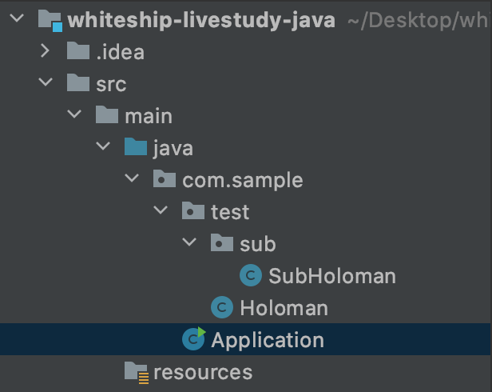

# 7주차 과제: 패키지 \#7

## 목표

- 자바의 패키지에 대해 학습하세요.

## 학습할 것(필수)

- [package 키워드](#package-키워드)
- [import 키워드](#import-키워드)
- [클래스패스](#클래스패스)
- [CLASSPATH 환경변수](#CLASSPATH-환경변수)
- [-classpath 옵션](#-classpath-옵션)
- [접근지시자](#접근지시자)

## 학습 내용

- package 키워드

  - 패키지는 Java 요소(클래스, 인터페이스, 예외, 에러, enum)의 묶음입니다. `package` 키워드는 해당 클래/인터페이스 등이 속하는 패키지명을 명시할 때, 사용됩니다.

    ```java
    package com.sample.me;
    
    public class Application{
    }
    ```

    위 예제 코드에서 `Application`이라는 클래스는 `com.sample.me`라는 패키지에 속합니다.

  - 패키지의 물리적인 구조

    - 패키지는 물리적으로 하나의 디렉토리라고 볼 수 있습니다. 따라서 일반 디렉토리 구조처럼 하나의 패키지가 다른 패키지를 포함할 수 있습니다.
      위 예시에서 나온 `com.sample.me`라는 패키지의 경우, `com` 디렉토리 하위에 `sample` 디렉토리가, `sample` 디렉토리 하위에 `me` 라는 디렉토리가 있습니다.

      > java에는 sub-package라는 개념이 없다!
      >
      > 그동안 "하위 패키지"라는 단어를 사용했는데, 찾아보니 Java에는 sub-package라는 개념이 없다고 합니다.
      > 예를 들어서, `java.awt` 패키지와 `java.awt.event` 를 보면, 두 패키지는 일부 prefix와 디렉토리 구조를 공유하고 있을 뿐, 완전히 별개의 패키지입니다.
      >
      > [참고 글 1: Package and Classpath - Package Name & the Directory Structure](https://www3.ntu.edu.sg/home/ehchua/programming/java/J9c_PackageClasspath.html)
      >
      > [참고 글 2: Java package in package?](https://stackoverflow.com/questions/13809713/java-package-in-package)
      >
      > - [(별첨) Sub package 관련 테스트](#Sub-package-관련-테스트)
      >
      >   --> 자신의 하위 디렉토리에 위치한 패키지라도 완전히 별도의 패키지로 취급됨을 확인했습니다.

  - 패키지 사용 시, 장점

    - 서로 관련된 클래스들을 그룹 단위로 묶을 수 있어서 관리하기가 쉽습니다.
    - 같은 이름의 클래스더라도 서로 다른 패키지에 존재할 수 있기 때문에 클래스명 중복 문제를 해결할 수 있습니다.

  - 기본 패키지

    - 모든 자바 클래스는 하나의 패키지 안에 속해야합니다. 만약 `package` 키워드로 해당 클래스가 속하는 패키지를 명시하지 않았다면, 해당 클래스는 default package에 속하게 됩니다.(권장하지 않는 방법)

- import 키워드

  - `import` 키워드는 특정 패키지/클래스/인터페이스를 사용하고 싶을 때, 사용합니다.

- 클래스패스

  - jvm이 프로그램을 실행하기 위해서 클래스파일을 찾을 때, 기준이 되는 파일 경로
  - 클래스패스를 지정하는 두 가지 방법
    1. `CLASSPATH` 환경변수 이용
    2. `-classpath` 사용

- CLASSPATH 환경변수

  - `CLASSPATH` 환경변수는 Java compiler/runtime에서 필요한 `$BASE_DIR` 경로 설정 시, 사용됩니다.

    예를 들어, `A` 클래스가 `com.sample.test` 라는 패키지에 있다면,
    해당 클래스는 "`$BASE_DIR/com/sample/test/A.class`" 로 만들어집니다.

    이때, Java compiler와 runtime에서 참조하는 `$BASE_DIR` 값이 `CLASSPATH` 환경변수 값입니다.

- -classpath 옵션

  - `-classpath` 옵션은 자바를 실행할 때 사용할 클래스들의 위치를 가상머신에게 알려주는 역할을 합니다.

    - 실행하려는 클래스명이 `A` 이고, runtime 시, 불러올 클래스 위치가 현재 디렉토리("`.`")와 현재 디렉토리 하위 디렉토리인 `lib` 이라는 디렉토리라면, 아래와 같이 실행해야합니다.

      ```
      java -classpath ".;lib" A
      ```

    - 위와 같이 매번 클래스 패스를 지정하는 번거로움을 해결하는 방법이 바로 클래스 패스를 시스템의 환경변수로 지정하는 것입니다.

- 접근지시자

  - 접근 제어자, Access Modifier

  - 접근 제어자가 사용될 수 있는 곳은 클래스, 멤버변수, 메서드, 생성자로, 총 4가지 종류의 접근 제어자가 있습니다.
    : `private`, `default`, `protected`, `public`

    - `private`
      - 같은 클래스 내에서만 접근 가능합니다.
        - 그래서 보통 클래스 내 멤버 변수에 대한 setter/getter 함수를 만들어서 사용합니다.
      - **`private` 멤버의 경우, 자손 클래스에서도 접근이 불가능합니다.**

    - `default` (기본값)
      - 같은 패키지 내에서만 접근이 가능합니다.
      - `default` 접근 제어자의 경우, 명시적으로 `default` 키워드를 붙이지 않습니다.
    - `protected`
      - 같은 패키지 내에서, 그리고 패키지에 관계없이 자손 클래스에서 접근이 가능합니다.
    - `public`
      - 접근 제한이 없습니다.


------

- 참고 자료

  - [Java Programming - Package and Classpath](https://www3.ntu.edu.sg/home/ehchua/programming/java/J9c_PackageClasspath.html)
  - [생활코딩 - 클래스 패스](https://opentutorials.org/course/1223/5527)
  - [자바 클래스패스(classpath)란?](https://effectivesquid.tistory.com/entry/%EC%9E%90%EB%B0%94-%ED%81%B4%EB%9E%98%EC%8A%A4%ED%8C%A8%EC%8A%A4classpath%EB%9E%80)
  - 책 - Java의 정석(남궁성 지음)

- 별첨

  - Sub-package 관련 테스트

    - 서브 패키지 구조 확인을 위해서, 아래와 같이 패키지를 만들었습니다.

      

    - 서브 패키지 개념이 존재한다면, `com.sample.test` 에 있는 모든 entity를 참조하는 것만으로도 `com.sample.test.sub.SubHoloman` 클래스를 불러올 수 있을 것이라 생각되어, 아래와 같이 메인클래스 코드를 써봤습니다.

      ```java
      package com.sample;
      import com.sample.test.*;
      
      public class Application {
          public static void main(String[] args) {
              Holoman holoman = new Holoman();
              SubHoloman subHoloman = new SubHoloman();
      
          }
      }
      
      ```

    - 위와 같이 코드를 썼을 때, `com.sample.test.sub` 패키지에 있는 `SubHoloman` 클래스를 정상적으로 참조하지 못하는 에러가 발생했습니다. 에러를 해결한 최종 코드는 아래와 같습니다.

      ```java
      package com.sample;
      import com.sample.test.*;
      import com.sample.test.sub.SubHoloman;
      
      public class Application {
          public static void main(String[] args) {
              Holoman holoman = new Holoman();
              SubHoloman subHoloman = new SubHoloman();
      
          }
      }
      ```

    - 위 테스트를 통해서, 물리적인 디렉토리 구조 상에서 계층 구조는 존재하지만, 실제로는 sub-package 개념이 존재하지 않음을 확인했습니다.