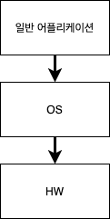
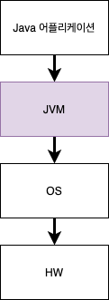
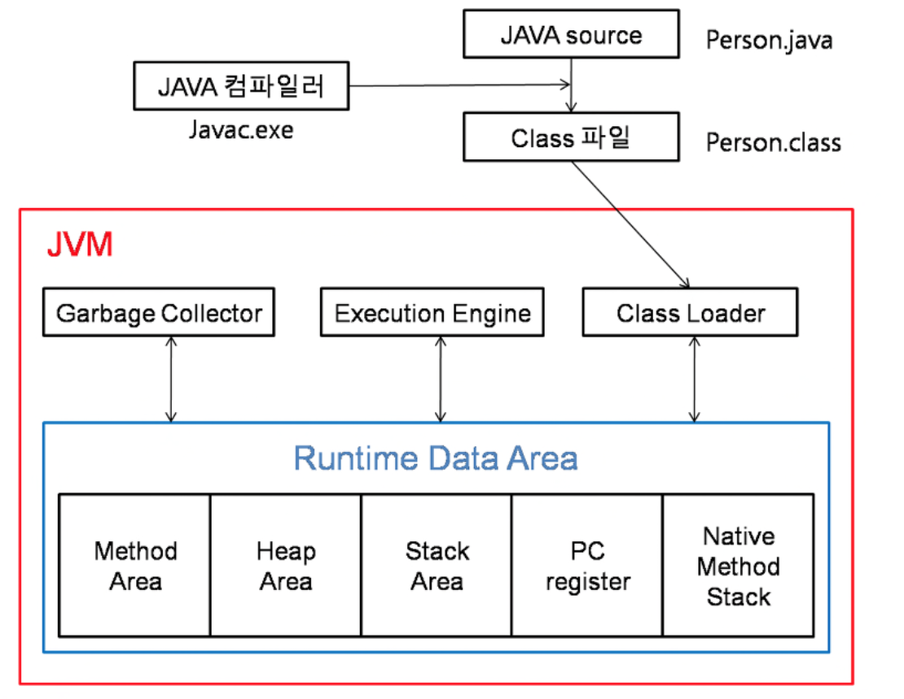

# 1주차 과제: JVM은 무엇이며 자바 코드는 어떻게 실행하는 것인가 \#1

## 목표

- 자바 소스 파일(.java)을 JVM으로 실행하는 과정 이해하기.

## 학습할 것

- [JVM이란 무엇인가](#JVM이란-무엇인가)
- [컴파일 하는 방법](#컴파일-하는-방법)
- [실행하는 방법](#실행하는-방법)
- [바이트코드란 무엇인가](#바이트코드란-무엇인가)
- [JIT 컴파일러란 무엇이며 어떻게 동작하는지](#JIT-컴파일러란-무엇이며-어떻게-동작하는지)
- [JDK와 JRE의 차이](#JDK와-JRE의-차이)

## 학습 내용

- JVM이란 무엇인가

  - JVM(Java virtual Machine)은 자바 어플리케이션을 실행하기 위한 프로그램으로,
    자바 바이트코드(`.class`)를 실행한다.

    - JVM은 리눅스, 윈도우 등 OS 뿐만 아니라, IE 등의 웹 브라우저에도 설치가 가능하며,
      휴대전화나 가전기기에도 설치 가능하다.

    - JVM이 수행하는 작업

      1) 코드 로딩

      2) 코드 검증

      3) 코드 실행

      4) 실행 환경(runtime environment) 제공

  - 일반적인 어플리케이션의 경우, 아래와 같이 어플리케이션의 코드는 OS만 거치고 하드웨어에 전달된다.

    

    하지만, java 어플리케이션의 경우, jvm을 거친 후에 OS를 거쳐서 하드웨어 전달된다.

    

  - 위와 같은 구조를 가졌을 때, 장점과 단점은 아래와 같다.

    - 장점

      1) OS와 하드웨어에 독립적이다.

      - java 어플리케이션의 경우, 항상 jvm 위에서 실행되기 때문에 OS/하드웨어에 구애받지 않는다.

    - 단점

      1) 자바 어플리케이션 코드가 하드웨어에 맞게 완전히 컴파일된 상태가 아니라, 실행 시에 해석(interpret) 되기 때문에 속도가 느리다.

      --> 이 부분의 경우, JIT 컴파일러와 최적화 기술의 향상으로 많이 개선되었다.

- 컴파일 하는 방법

  - 명령어로 자바 소스코드 컴파일 하는 방법

    ```shell
    javac YouSouceFile.java
    ```

    --> 위와 같이 자바 소스코드를 컴파일하면 `.class` 라는 확장자를 가진 자바 바이트코드 파일을 얻게 된다.

- 실행하는 방법

  - 명령어로 자바 프로그램 실행하는 방법

    - 컴파일된 자바 바이트코드(`.class`)를 실행한다.

      ```
      java YourClassName
      ```

  - 컴파일이 완료된 자바 바이트코드(`.class`)를 실행하는 게 바로 JVM이다.
    아래 그림을 보자.

    

    

    > 그림 출처: [dnjscksdn98.log - [Java] What is JVM?](https://velog.io/@dnjscksdn98/Java-What-is-JVM)

    --> 자바 컴파일러로 컴파일 완료된 자바 바이트코드(`.class`) 는 jvm에 의해서 메모리에 적재되고, 실행된다.

    이 자세한 과정을 알아보기 위해서 jvm의 구성 요소를 자세히 살펴보자.

  - 자바 어플리케이션을 실제로 실행하는 JVM의 구성 요소

    1) Class Loader

    - 자바 컴파일의 결과물인 자바 바이트코드(`.class`)를 Runtime Data Area 형태로 메모리에 적재한다.

    - 자바에서 클래스 로딩은 동적으로 일어난다. 동적 클래스 로딩에는 1) 로드타임 동적 로딩(load-time dynamic loading)과 2) 런타임 동적 로딩(runtime dynamic loading)이 있다.

      1) 로드타임 동적 로딩: **하나의 클래스를 로딩하는 과정에서** 해당 클래스와 관련된 클래스를 로딩하는 것

      ```java
      package com.quriemoon.practiceSE;
      
      public class PracticeApplication {
      	public static void main(String[] args) {
      		System.out.println("Hi");
      	}
      }
      ```

      - 위 자바 소스코드를 컴파일한 후에 실행 시, 아래 클래스들이 로드타임에 동적으로 로딩된다.

        ```
        java.lang.String
        java.lang.System
        ```

      2) 런타임 동적 로딩: **메소드가 실행될 때,** 클래스를 로딩하는 것을 가리킨다.

      - 아래 포스트에서 런타임 동적 로딩의 예시를 확인할 수 있다. (RuntimeLoading 클래스 부분)

        [자바캔(Java Can Do IT) - 클래스로더 1, 동적인 클래스 로딩과 클래스로더](https://javacan.tistory.com/entry/1)

    - JVM class loader에는 3가지 종류가 있다.

      1. Bootstrap ClassLoader
         - 최상위 classloader로, `java.lang` 패키지와 같은 java의 기본 클래스들을 담고 있는 `rt.jar` 파일을 로딩한다.
      2. Extension ClassLoader
         - BootStrap Classloader의 자손 클래스에 해당하며, `*$JAVA_HOME/jre/lib/ext` 에 있는 jar 파일을 로딩한다.
      3. System/Application ClassLoader
         - Extension Classloader의 자손 클래스로, classpath에 있는 클래스파일을 읽어온다.

    2) Runtime Data Area

    - JVM이 OS 위에 실행되면서 할당받는 메모리 영역으로, class loader에서 올린 데이터들이 보관되는 곳이다.
    - [Runtime Data Area 구성 상세 설명 참고 링크](https://velog.io/@dnjscksdn98/Java-What-is-JVM)

    3) Execution Engine

    - Runtime Data Area에 배치된 자바 바이트코드(`.class`)를 실행한다.
    - Execution Engine의 구성
      1. A virtual processor
      2. Interpreter
         - 바이트코드를 읽어와서 명령어를 수행한다.
      3. Just-In-Time(JIT) compiler
         - 퍼포먼스 향상을 위한 부분

    4) Garbage Collector

    - Runtime Data Area 내 Heap 메모리 영역에서 더 이상 Stack Area에서 참조되지 않는 객체들을 제거한다.

- 바이트코드란 무엇인가

  - Java 소스코드가 컴파일되었을 때 생기는 결과물로, JVM이 실제로 수행하는 코드이다.

    

    > 그림 출처 : [edureka! - What is Bytecode in java and how it works?](https://www.edureka.co/blog/java-bytecode/)

- JIT 컴파일러란 무엇이며 어떻게 동작하는지

  - JIT 컴파일러는 **run time에** java 바이트코드(`.class`)를 native machine code로 바꿔놓는다.
    이렇게 JIT 을 통해서 컴파일된 메소드는 이후에 JVM에서 해석(interpret)되는 과정 없이 바로 호출된다.

  - JIT 컴파일러가 동작하는 과정은 아래 순서도에서 확인할 수 있다.

    

    하지만, 모든 메소드가 JIT 컴파일러를 통해서 컴파일 되는 것은 아니다.

    OpenJ9에 따르면, 각 메소드별로 호출되는 횟수를 기록한 후에 특정 메소드가 사전에 정의된 임계값(threshold)를 넘는 경우에만 JIT 컴파일러에 의해 컴파일된다.

  - JIT 컴파일러의 장점

    - JIT 컴파일러가 없다면 매번 JVM 스스로 추가적인 CPU와 메모리 자원을 활용하여, java 바이트코드를 해석해야한다. 하지만, JIT 컴파일러 덕분에 이러한 부분이 줄어들면서 java 어플리케이션의 성능이 향상되었다.

- JDK와 JRE의 차이

  - JRE(Java Runtime Environment)

    - JRE는 자바 프로그램을 실행하기 위한 환경이다.

    - JRE는 JVM이 java 어플리케이션을 실행할 때, 필요한 라이브러리 파일들과 기타 파일들을 가지고 있다.

      

  - JDK(Java Development Kit)

    - JDK는 자바 개발도구로, JRE + 𝜶 (javac 등)이다. 

      


------

- 참고 자료

  - 책 - Java의 정석(남궁성 지음)
  - [위키피디아 - 자바 가상 머신](https://ko.wikipedia.org/wiki/%EC%9E%90%EB%B0%94_%EA%B0%80%EC%83%81_%EB%A8%B8%EC%8B%A0)
  - [dnjscksdn98.log - [Java] What is JVM?](https://velog.io/@dnjscksdn98/Java-What-is-JVM)
  - [자바캔(Java Can Do IT) - 클래스로더 1, 동적인 클래스 로딩과 클래스로더](https://javacan.tistory.com/entry/1)
  - [javatpoint - JVM (Java Virtual Machine) Architecture](https://www.javatpoint.com/jvm-java-virtual-machine)
  - [edureka! - What is Bytecode in java and how it works?](https://www.edureka.co/blog/java-bytecode/)
  - [OpenJ9 - The JIT compiler](https://www.eclipse.org/openj9/docs/jit/)
  - [Oracle - JRE - JIT compiler process](https://docs.oracle.com/cd/E19455-01/806-3461/6jck06gqd/index.html)
  - [점프 투 자바 - B. JVM, JRE, JDK의 차이](https://wikidocs.net/257)

